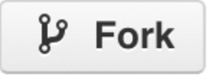
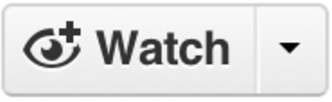
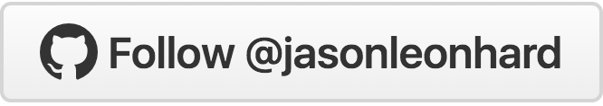

## To view the project

#### clone and cd into the repo

    git clone git@github.com:jasonleonhard/bar_graph.git
    cd bar_graph

#### open a python local server

    python -m SimpleHTTPServer 8000 ;

#### Open your Browser to

    localhost:8000

### Open a new terminal window

#### View git branches

    git branch

#### Change git branches

    git checkout bar_graph2 # bar_graph2 upto master

#### Refresh your browser

#### Rinse repeat

# Enjoyed this project? Why not give us a star!?!?

<!-- just links to top of page where you can star, fork, watch -->

<!-- just links to page where you can follow -->

<!-- MUST HAVE FOR ALL -->
<!-- Place this tag in your head or just before your close body tag. -->

<!-- FORK -->
<a class="github-button" href="https://github.com/jasonleonhard/bar_graph/fork" data-icon="octicon-repo-forked" data-style="mega" aria-label="Fork jasonleonhard/bar_graph on GitHub">Fork</a>

<!-- STAR -->
<a class="github-button" href="https://github.com/jasonleonhard/bar_graph" data-icon="octicon-star" data-style="mega" aria-label="Star jasonleonhard/bar_graph on GitHub">Star</a>

<!-- WATCH -->
<a class="github-button" href="https://github.com/jasonleonhard/bar_graph" data-icon="octicon-eye" data-style="mega" aria-label="Watch jasonleonhard/bar_graph on GitHub">Watch</a>

<!-- FOLLOW -->
<a class="github-button" href="https://github.com/jasonleonhard" data-style="mega" aria-label="Follow @jasonleonhard on GitHub">Follow @jasonleonhard</a>

<!-- In markdown this should build the buttons, with images, which trigger actions -->

